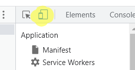

#Discord Userbot
## How to easily make discord user bot. This will only work with discord.py, so here is a step by step tutorial.

1. Install python to your computer. I used 3.10.5, but any version of 3.x.x works. https://www.python.org/downloads/
2. Install discord.py, any version 1.6.0 or before. If your code doesn't work with this, too bad, its the only way. Here is the install command: `pip install discord.py==1.6.0`. Replace `1.6.0` with whatever version you want. 
3. Set your bot up, its bot.py file in a structure like this. Replace `usertokengoeshere` with your discord user token. To find your usertoken, follow these quick steps for Google Chrome

	1.	press **“CTRL” + “SHIFT” + “I”** on your keyboard.
	2.	**Click on the “>>” icon** to open more options.
	3.	**Click on “Application”** to go to the application page.
	4.	On the top left corner of the Inspect Window, click the highlighted button, as shown below
	5.	
	6.	Under “Storage”, **click on “Local Storage”** to expand it.
	7.	Click on “https://discord.com”
	8.	Search for “token” and copy your Discord token (Without parenthesis)
	9.	That's your token! Paste it in to the `usertokengoeshere!`
```
import discord

client = discord.Client()

@client.event
async def on_ready():
    print('Bot is ready.')
	print('CodeGoesHere')
client.run('usertokengoeshere', bot=False)
```
take note of the `bot=False` as it is the link to turn on the user bot.
To start your bot, run `python bot.py`
If you need any help, create an issue in this repo, here https://github.com/ExtremeMemes/discord-userbot/issues

For me, I was just trying to get the channel ID's, if anyone wants it, here is the code. I used discord.py 1.6.0, for this.

```
import discord

client = discord.Client()

@client.event
async def on_ready():
    print('Bot is ready.')
    guild = client.get_guild(put_server_id_here)
    if guild:
        for channel in guild.channels:
            print(f'{channel.name}: {channel.id}')
    else:
        print('Could not find guild.')

client.run('NzA2OTQyMDQ2MDc3OTc2NTc3.GDj7Q-.KJftwJF1sc9rUVFaXPF8Kbfk6IWBvbX76Dryws', bot=False)


```
